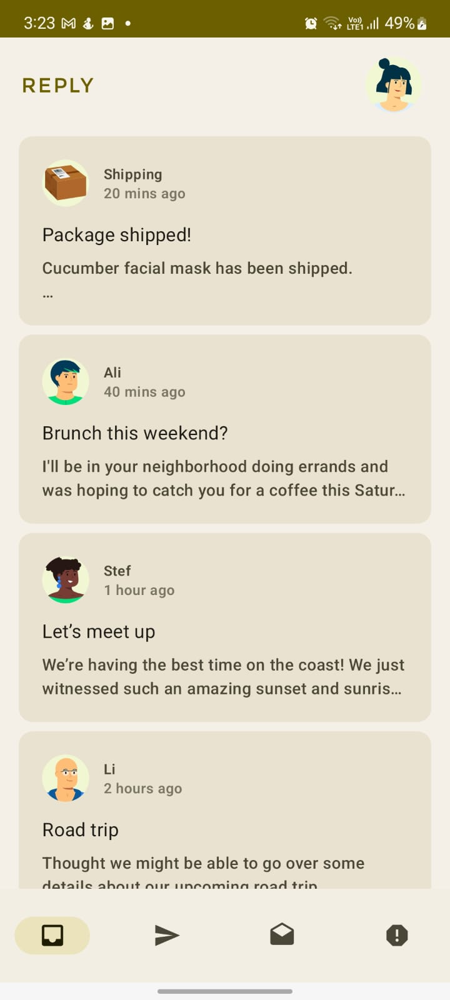

Reply App - Solution Code
=================================
Starter Code for Android Basic with Compose sample App - Replay


## Design & Screenshots



Introduction
------------
The Reply app is a simple email client that display various categories of your
inbox. This app is used to illustrate the concept of adaptive layout.

Pre-requisites
--------------

* Experience with Kotlin syntax.
* How to create and run a project in Android Studio.
* How to create composable functions
* How to create compose navigation

Getting Started
---------------

1. Install Android Studio, if you don't already have it.
2. Download the sample.
3. Import the sample into Android Studio.
4. Build and run the sample.

Implementing
------------


Creditis and License
--------------------
We used this app for educational Purpose only. All rights are served by Google Developer Team.
## License
```
Copyright 2022 The Android Open Source Project

Licensed under the Apache License, Version 2.0 (the "License");
you may not use this file except in compliance with the License.
You may obtain a copy of the License at

    https://www.apache.org/licenses/LICENSE-2.0

Unless required by applicable law or agreed to in writing, software
distributed under the License is distributed on an "AS IS" BASIS,
WITHOUT WARRANTIES OR CONDITIONS OF ANY KIND, either express or implied.
See the License for the specific language governing permissions and
limitations under the License.
```

[compose]: https://developer.android.com/jetpack/compose
[reply]: https://m3.material.io/foundations/adaptive-design/overview
[materialtheming]: https://m3.material.io/styles/color/dynamic-color/overview
